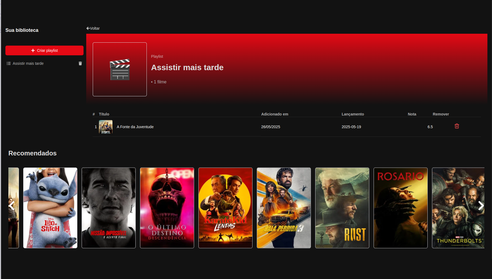
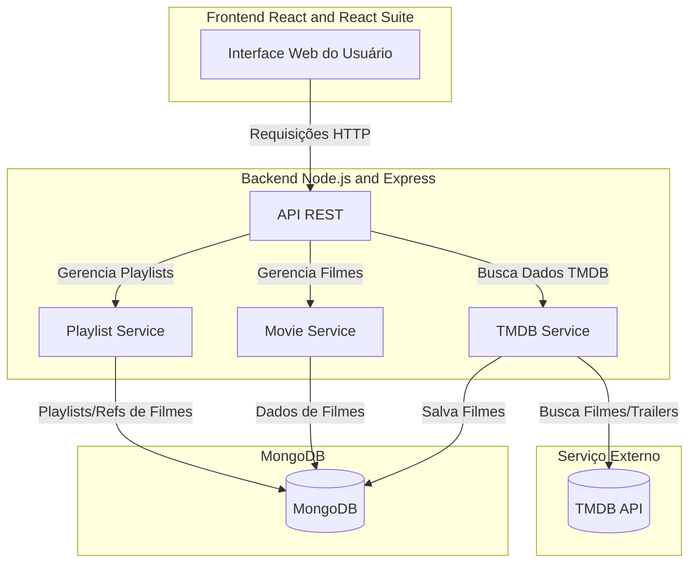

[](https://github.com/anabrag/desafio-ntt-data/actions/workflows/ci.yaml)
# Desafio NTT Data: Video playlist




Foi desenvolvido neste monorepo uma api utilizando nodejs, express e mongoose para conexão com banco de dados. Para o frontend uma aplicação react, utilizando a biblioteca gráfica React Suite. Os testes foram criados utilizando Jest e também foi utilizada a API TMDB para alimentar os dados do sistema.
A arquitetura da aplicação foi pensada na simplificadade para cumprir os objetivos do desafio no prazo definido. Abaixo segue um pequeno exemplo da arquitetura da aplicação

# Arquitetura



# Como rodar o projeto

## NodeJS Local + Docker para Database

```bash
make run_backend
make run_frontend
```


## Docker para Backend e Database

```bash
make run_docker
```